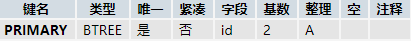

# Phase2Project  

>Author : SSS-Heng  
>Note : 电商的仿写——锤子商城（仅5个页面）  
>
>>+ ./output/min/的内容仅仅是压缩的结果，如果要使用，请先将后缀名中的".min"去掉  
>>+ 由于利用了jQuery的AJAX请求，请在服务器上运行。

# 函数说明  

## input_verification.js  

验证用户名、邮箱、手机号、密码的函数

    verification(type,data);  
    .verify(type,data);

参数|预设值|描述  
:-:|:-:|:-  
type||字符串类型,输入验证类型  
&nbsp;|"tel"|验证手机号，格式：11位数字  
&nbsp;|"email"|验证邮箱，格式：常见的邮箱格式  
&nbsp;|"username"|验证用户名，格式：10位以内字母数字下划线汉字  
&nbsp;|"telAndEmail"|验证登录输入的手机号/邮箱，格式：见上文  
&nbsp;|"password"|验证密码，格式：6~18位字母数字下划线特殊字符  
data||字符串类型，获取并验证的数据  
result||函数返回值，返回验证结果  
&nbsp;|"X_format_error"|验证的数据格式错误，X_：u_用户名或登录输入的手机号/邮箱，t_手机号，e_邮箱，p_密码  
&nbsp;|"X_format_ok"|验证的数据格式正确，X_：同上，但没有p_  
&nbsp;|"false"|传入的数据为空或出现错误,无法验证  
&nbsp;|"p_strength_low"|密码强度低，纯数字或纯字母  
&nbsp;|"p_strength_high"|密码强度最强，即包含至少一个数字，一个大写字母，一个小写字母，一个特殊符号  
&nbsp;|"p_strength_middle"|密码强度中等，即密码格式正确的情况下，除最强和低以外的其他情况  

# 测试服务器版本  

  
  

# 账户数据库结构  

  
  

# 日志  

## 2020\.09\.28  

Time|Name|Event  
:-:|:-:|:-  
11:40|SSS-Heng|创建库  
21:00|SSS-Heng|home.html添加几个class作为js事件操作的插入点  
21:00|SSS-Heng|home.scss修改部分属性  
21:00|SSS-Heng|home.js,home_main.js,home_insert.js完善  
21:00|SSS-Heng|home_behavior.js创建并完成  
21:00|SSS-Heng|执行gulp build  
21:02|SSS-Heng|上传"28日的修改"（警告：未进行代码测试）  
21:04|SSS-Heng|上传"28日的追加的紧急修改"（警告：未进行代码测试）  

## 2020\.09\.29  

Time|Name|Event  
:-:|:-:|:-  
12:00|SSS-Heng|debug"28日的修改"中的代码  
12:00|SSS-Heng|fix"28日的修改"中的代码  
12:00|SSS-Heng|修正require.js加载的路径问题  
12:00|SSS-Heng|注释home.html中的伪结构  
12:00|SSS-Heng|为home_insert.js中的slide_show函数添加回调函数方便添加轮播动画  
12:00|SSS-Heng|完善home_behavior.js的函数中细节问题  
12:10|SSS-Heng|debug整个工程项目  
12:10|SSS-Heng|上传"29日中午的修改"  
15:00|SSS-Heng|部分文件重命名  
15:00|SSS-Heng|上传"29日下午的修改"  
18:00|SSS-Heng|编写signin.html同时编写signin.scss  
21:15|SSS-Heng|上传"29日晚上的修改"

## 2020\.09\.30  

Time|Name|Event  
:-:|:-:|:-  
09:00|SSS-Heng|继续编写signin.html以及signin.scss  
11:20|SSS-Heng|上传"30日中午的修改"  
12:16|SSS-Heng|上传"30日中午追加的修改"  
16:40|SSS-Heng|signin.html及signin.scss完成和测试  
16:42|SSS-Heng|上传"30日下午的修改"  
22:00|SSS-Heng|重命名signin.scss=>siginin_signup.scss  
22:00|SSS-Heng|完成signup.html，完善signin_signup.scss，测试  
23:00|SSS-Heng|上传"30日晚上的修改"  

## 2020\.10\.01  

Time|Name|Event  
:-:|:-:|:-  
9:00|SSS-Heng|创建signin.js、signin_main.js、input_verification.js  
12:50|SSS-Heng|上传"10月1日上午的修改"  
23:55|SSS-Heng|上传"10月1日晚上的修改"  

## 2020\.10\.02  

Time|Name|Event  
:-:|:-:|:-  
1:55|SSS-Heng|创建signin.php，完善signin.js  
1:55|SSS-Heng|上传"10月2日凌晨的修改"  
22:00|SSS-Heng|创建并完成signup.js、signup_main.js、signup.php  
22:35|SSS-Heng|上传"10月2日晚上的修改"  

## 2020\.10\.03  

Time|Name|Event  
:-:|:-:|:-  
14:00|SSS-Heng|对signin.html和signup.html以及关联js做debug（PHP部分未测试）  
14:00|SSS-Heng|上传"10月3日中文的修改"  
17:00|SSS-Heng|创建hot_goods.json作为json数据  
20:08|SSS-Heng|创建goods.html以及goods.scss  
23:08|SSS-Heng|上传"10月3日晚上的修改"  

## 2020\.10\.05  

Time|Name|Event  
:-:|:-:|:-  
0:30|SSS-Heng|创建goods.html和goods.scss  
0:30|SSS-Heng|上传"10月5日凌晨的修改"  

## 2020\.10\.06  

Time|Name|Event  
:-:|:-:|:-  
0:40|SSS-Heng|完成goods.html和goods.scss测试  
0:40|SSS-Heng|上传"10月6日凌晨的修改"  
9:00|SSS-Heng|创建shopping_cart.html和shopping_cart.scss  
23:00|SSS-Heng|完成shopping_cart.html和shopping_cart.scss（警告，未测试）  
23:10|SSS-Heng|上传"10月6日晚上的修改"  

## 2020\.10\.08  

Time|Name|Event  
:-:|:-:|:-  
0:40|SSS-Heng|新建并完成small_cart.js、goods.js、goods_main.js、shopping_cart.js、shopping_cart_main.js（警告：未测试）  
0:46|SSS-Heng|上传"10月8日凌晨的修改"  
0:50|SSS-Heng|上传"10月8日凌晨的追加修改"  
16:30|SSS-Heng|整个工程debug完成，工程主要内容基本完成  
16:36|SSS-Heng|上传"10月8日下午的修改"  
